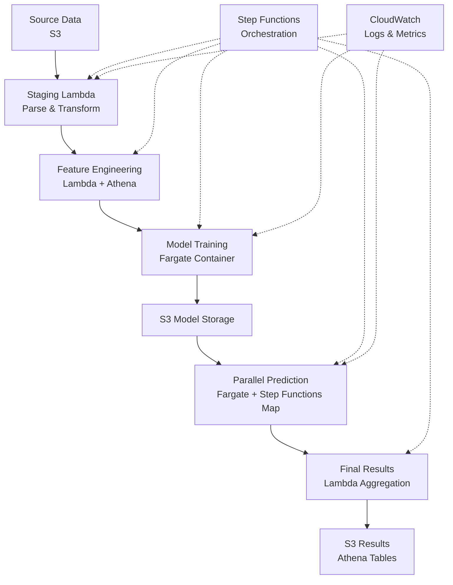

# Age Prediction Pipeline – AWS Serverless Learning Project

A learning-focused proof-of-concept demonstrating batch ML orchestration patterns using AWS serverless and container services. This reference implementation shows how to build scalable ML pipelines with Step Functions, Fargate, Lambda, and Athena.

**New to the project?**  
Start with *Why This Project Exists* and *AWS Architecture Overview* for a high-level understanding, then explore design decisions and lessons learned.

[Documentation](docs/) | [Architecture](docs/architecture.md) | [Lessons Learned](docs/lessons-learned.md) | [Author](AUTHOR.md)

## Why This Project Exists

This is a **public learning project** created to share architectural decisions and lessons learned with the AWS community. It is not affiliated with any employer and was built independently to explore:

- Serverless ML orchestration patterns with AWS Step Functions
- Cost-aware batch processing strategies with Amazon Athena
- Container vs serverless trade-offs for ML workloads (Lambda vs Fargate)
- Infrastructure as Code practices for ML pipelines with Terraform

The goal is to provide a reference implementation that other builders can learn from, adapt, and improve upon.

## Who This Is For

This project is designed for builders who want to learn:

- **Step Functions orchestration patterns** – How to coordinate complex multi-stage workflows
- **Lambda vs Fargate trade-offs** – When to use serverless functions vs containers for batch jobs
- **S3 + Athena analytics patterns** – Serverless data warehousing and feature engineering
- **Terraform/IaC for ML infrastructure** – Infrastructure as Code patterns for ML pipelines
- **Cost-aware design** – Strategies for optimizing serverless ML costs
- **Error handling and retries** – Building resilient batch processing pipelines

## What Is This?

An example ML pipeline that demonstrates:

- **Batch ML orchestration** – End-to-end workflow from data staging to predictions
- **Feature engineering** – Extracting and transforming features from raw data
- **Model training** – Training regression models (Ridge, XGBoost) on labeled data
- **Parallel prediction** – Distributed batch prediction using Step Functions Map state
- **Confidence scoring** – Providing uncertainty estimates alongside predictions
- **Infrastructure as Code** – Terraform configuration for AWS resources

## AWS Architecture Overview

The diagram below represents the full reference architecture; individual components can be studied independently.



### AWS Services Used

- **AWS Step Functions** – Orchestrates pipeline stages with error handling and retries
- **AWS Lambda** – Event-driven functions for data preparation, orchestration, and cleanup
- **AWS Fargate** – Serverless containers for ML training and batch prediction
- **Amazon Athena** – Serverless SQL queries on S3 data for feature engineering
- **Amazon S3** – Data lake storage for features, models, and results
- **AWS Glue Data Catalog** – Metadata catalog for Athena tables
- **Amazon ECR** – Container registry for Docker images
- **Amazon ECS** – Container orchestration platform for Fargate
- **AWS IAM** – Fine-grained access control with least-privilege policies
- **Amazon CloudWatch** – Logging, monitoring, and cost alarms
- **AWS VPC Endpoints** – Private connectivity to AWS services

## End-to-End Flow

1. **Pre-Cleanup** – Lambda removes old data and prepares for new run
2. **Staging** – Lambda parses JSON fields and creates staging tables via Athena
3. **Feature Engineering** – Lambda uses Athena CTAS to create training and evaluation feature sets
4. **Training** – Fargate container trains regression models on labeled data, saves to S3
5. **Batch Generation** – Lambda calculates batches and generates batch IDs for parallel processing
6. **Parallel Prediction** – Step Functions Map state launches multiple Fargate tasks in parallel
7. **Aggregation** – Lambda merges predictions with source data and creates final results table
8. **Cleanup** – Lambda removes intermediate data to minimize storage costs

## Key Design Decisions & Trade-offs

### 1. Step Functions vs Airflow
- **Decision:** Step Functions for orchestration
- **Reason:** Native AWS integration, serverless, pay-per-use, built-in error handling
- **Trade-off:** Less flexibility than Airflow but better AWS integration and lower operational overhead
- **Alternative Considered:** Apache Airflow on ECS (rejected due to infrastructure management overhead)

### 2. Fargate vs Lambda for ML Training
- **Decision:** Fargate for longer-running training jobs
- **Reason:** Lambda has 15-minute timeout limit; training requires more time with retries
- **Trade-off:** Higher cost per execution but necessary for long-running ML workloads
- **Alternative Considered:** EC2 Spot Instances (rejected due to complexity and potential interruptions)

### 3. Athena vs Redshift
- **Decision:** Athena for data warehousing
- **Reason:** Serverless, pay-per-query, no infrastructure management, automatic scaling
- **Trade-off:** Higher per-query cost but no idle costs; perfect for batch processing
- **Alternative Considered:** Amazon Redshift (rejected due to cluster management and idle costs)

### 4. Parquet vs JSON for Data Storage
- **Decision:** Parquet with Snappy compression
- **Reason:** Significant cost reduction in Athena queries, faster query performance, columnar format
- **Trade-off:** Slightly more complex ETL but substantial cost savings
- **Alternative Considered:** JSON/JSONL (rejected due to higher query costs)

### 5. Step Functions Map State vs Custom Orchestration
- **Decision:** Native Map state for parallel predictions
- **Reason:** Built-in parallelism, error handling, and retry logic
- **Trade-off:** 256KB output limit required `ResultPath = null` workaround
- **Alternative Considered:** Custom Lambda orchestrator (rejected due to complexity)

### 6. ARM64 vs X86_64 Architecture
- **Decision:** X86_64 for Fargate tasks
- **Reason:** Better capacity availability for large-scale parallel execution
- **Trade-off:** Higher cost but significantly better availability and reliability
- **Alternative Tested:** ARM64 (rejected due to capacity constraints at scale)

The sections below provide deeper context for builders who want to understand service-level decisions and trade-offs in more detail.

## AWS Services Deep Dive

### AWS Step Functions
- **Why:** Orchestrates multiple pipeline stages with error handling, retries, and parallel execution
- **Key Feature:** Map state for parallel batch processing with automatic scaling
- **Learning:** How to handle 256KB output limits with large parallel executions by using `ResultPath = null`
- **Cost:** Pay per state transition – minimal cost for orchestration

### AWS Fargate
- **Why:** Serverless containers for ML training/prediction without managing EC2 instances
- **Key Feature:** Auto-scaling based on workload, with ARM64 and X86_64 options
- **Learning:** Cost optimization by choosing X86_64 for better capacity availability despite ARM64 being cheaper
- **Architecture:** Configurable CPU/memory for training and prediction workloads

### Amazon Athena
- **Why:** Serverless SQL queries on S3 data without data warehouse setup or maintenance
- **Key Feature:** CTAS (Create Table As Select) for feature engineering directly from source data
- **Learning:** Optimizing Parquet partitioning and bucketing for query performance and cost reduction
- **Optimization:** Snappy compression, bucketed tables for parallel processing

### AWS Lambda
- **Why:** Event-driven functions for data preparation, orchestration, and cleanup
- **Key Feature:** Multiple Lambda functions coordinating different pipeline stages
- **Learning:** When to use Lambda vs Fargate (Lambda for <15 min, Fargate for longer/compute-intensive)
- **Functions:** Staging, feature engineering, batch generation, table creation, aggregation, cleanup

### Amazon S3
- **Why:** Data lake storage for ML features, models, and results with lifecycle management
- **Key Feature:** Organized prefixes for Athena table management and cost optimization
- **Learning:** Organizing S3 prefixes for efficient Athena queries and cleanup automation
- **Storage:** Parquet files with compression, lifecycle policies for cost control

### AWS Glue Data Catalog
- **Why:** Metadata catalog for Athena tables with automatic schema discovery
- **Key Feature:** Automatic schema discovery from Parquet files, table partitioning
- **Learning:** Managing table partitions, external locations, and schema evolution
- **Integration:** Seamless integration with Athena for serverless data warehousing

### Amazon ECR
- **Why:** Container registry for Docker images used by Fargate tasks
- **Key Feature:** Image scanning on push, versioning, and lifecycle policies
- **Learning:** Optimizing Docker image sizes for faster pulls and lower storage costs

### Amazon ECS
- **Why:** Container orchestration platform for running Fargate tasks
- **Key Feature:** Cluster management, task scheduling, and resource allocation
- **Learning:** Configuring clusters for optimal capacity and cost

### AWS IAM
- **Why:** Fine-grained access control for all AWS services
- **Key Feature:** Least-privilege policies for Lambda, Fargate, and Step Functions
- **Learning:** Best practices for IAM roles, policies, and cross-service permissions

### Amazon CloudWatch
- **Why:** Logging, monitoring, and alerting for the pipeline
- **Key Feature:** Log groups for Lambda and Fargate, cost alarms
- **Learning:** Setting up cost alarms and monitoring for batch ML pipelines

### AWS VPC Endpoints
- **Why:** Private connectivity to AWS services without internet gateway
- **Key Feature:** ECR, S3, and CloudWatch Logs endpoints for secure Fargate execution
- **Learning:** Configuring VPC endpoints for cost optimization and security

## Security, Privacy, and Cost Considerations

### Security
- **IAM Least Privilege:** All services use minimal required permissions
- **VPC Endpoints:** Fargate tasks use private connectivity to AWS services
- **Environment Variables:** Sensitive configuration via environment variables, not hardcoded
- **No Secrets in Code:** All credentials and API keys managed through AWS Secrets Manager or environment variables
- **Note:** This is guidance for learning projects, not audited compliance. For production use, consult AWS security best practices and compliance requirements.

### Privacy
- **Synthetic Data:** Any example data should be synthetic or anonymized
- **No PII:** This project does not process real personal identifiable information
- **Data Handling:** Follow AWS data handling best practices for any real data

### Cost Considerations
- **Athena Costs:** Primary cost driver is data scanned – optimize with Parquet compression and partitioning
- **Fargate Costs:** Scale with workload – right-size CPU/memory to balance cost and performance
- **Storage Costs:** Use lifecycle policies and automated cleanup to minimize S3 storage costs
- **Monitoring:** Set up CloudWatch cost alarms to track spending
- **Sandbox Accounts:** Recommended to use AWS sandbox accounts or set budget limits for learning
- **Note:** Actual costs vary by region, data size, and usage patterns. Always monitor your AWS billing.

## Getting Started

### Prerequisites

- AWS Account with appropriate permissions
- Terraform >= 1.0
- AWS CLI configured
- Docker (for building container images)
- Python 3.11+ (for local development)

### Quick Start

1. **Clone the repository:**
   ```bash
   git clone https://github.com/tarverryan/poc-ai-app-predict-age.git
   cd poc-ai-app-predict-age
   ```

2. **Configure Terraform variables:**
   Create `terraform/terraform.tfvars` with your configuration (see [CONTRIBUTING.md](CONTRIBUTING.md) for details)

3. **Deploy infrastructure:**
   ```bash
   cd terraform
   terraform init
   terraform plan
   terraform apply
   ```

4. **Build and push Docker images:**
   See [CONTRIBUTING.md](CONTRIBUTING.md) for detailed instructions

5. **Run the pipeline:**
   Start the Step Functions execution via AWS Console or CLI

For detailed setup instructions, see [CONTRIBUTING.md](CONTRIBUTING.md).

## Documentation

- **[Architecture Overview](docs/architecture.md)** – System architecture and component responsibilities
- **[Lessons Learned](docs/lessons-learned.md)** – What worked, what surprised us, and what we'd improve
- **[Project Structure](docs/PROJECT_STRUCTURE.md)** – Repository organization and file structure
- **[Deployment Guide](docs/deployment/DEPLOYMENT_SUMMARY.md)** – Infrastructure deployment details
- **[SQL Files Reference](docs/SQL_FILES_README.md)** – SQL file organization and usage
- **[Contributing Guide](CONTRIBUTING.md)** – Setup and contribution instructions

## Author

**Created and maintained by [Ryan Tarver](https://github.com/tarverryan)**

AWS enthusiast and ML engineer passionate about serverless architectures, cost optimization, and building scalable ML systems. This project was created as a learning exercise and shared publicly for the AWS community.

- **GitHub:** [@tarverryan](https://github.com/tarverryan)
- **Email:** rytahub@gmail.com

---

**Status:** Learning Project / Reference Implementation  
**Version:** 1.0  
**Last Updated:** January 2025  
**License:** MIT
